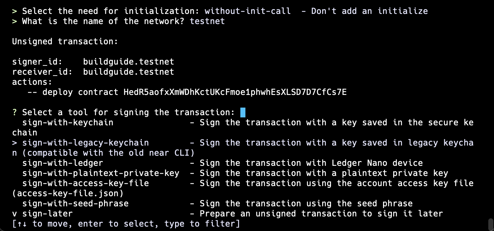

# Verifying Smart Contracts on NEAR: Step-by-Step Guide

Source code verification provides transparency for users interacting with smart contracts. By uploading the source code, tools like Etherscan match the compiled code with the on-chain code. This ensures end users know what they are "digitally signing" and can audit the code independently to verify its functionality.

Ensuring reproducible WebAssembly (WASM) builds is essential for NEAR contracts. Compiling WASM can result in different outputs depending on the hardware, operating systems, and environments, making it difficult to confirm that the on-chain bytecode matches the original source. NEP-330 addresses this by extending support for contract source metadata, enabling reproducible WASM builds and verifiable source code.

### Step 1: Install Required Tools

First, you need to install the latest version of Rust by following the instructions here:  
[Install Rust](https://www.rust-lang.org/learn/get-started)

Since `cargo-near` depends on Git, ensure Git is installed on your system. After installation, configure Git with your details:

```bash
git config --global user.email "you@example.com"
git config --global user.name "Your Name"
```

Additionally, you will need to install Docker Engine on your system:  
[Install Docker Engine](https://docs.docker.com/engine/install)

For non-root users, follow these instructions to manage Docker as a non-root user:  
[Docker Post-installation Steps](https://docs.docker.com/engine/install/linux-postinstall)

To verify a smart contract on NEAR, install the following tools:

- **cargo-near**: [Install cargo-near](https://github.com/near/cargo-near)
- **near-cli-rs**: [Install near-cli-rs](https://github.com/near/near-cli-rs)

`cargo-near` is required to create a new contract based on the reproducible contract template, build the contract, and deploy it on the NEAR blockchain.

`near-cli-rs` will be required for creating or importing the NEAR account that you would like to deploy your contract to.

### Step 2: Create or Update Contract with NEP-330 Support

In this guide, we will use `cargo-near` to create a new contract from a template. However, you can also update your existing contract to be aligned with NEP-330 standards.

To create a new contract using `cargo-near`, run the following command:

```bash
cargo near new
```


### If you want to update your existing contract:

Here's an example `Cargo.toml` file with the necessary metadata for reproducibility using NEP-330:

```toml
[package]
name = "test"
description = "cargo-near-new-project-description"
version = "0.1.0"
edition = "2021"
# TODO: Fill out the repository field to help NEAR ecosystem tools to discover your project.
# NEP-0330 is automatically implemented for all contracts built with https://github.com/near/cargo-near.
# Link to the repository will be available via `contract_source_metadata` view-function.
repository = "https://github.com/<xxx>/<xxx>"

[lib]
crate-type = ["cdylib", "rlib"]

# Fields to configure build with WASM reproducibility, according to specs
# in https://github.com/near/NEPs/blob/master/neps/nep-0330.md
[package.metadata.near.reproducible_build]
# Docker image, descriptor of build environment
image = "sourcescan/cargo-near:0.8.2-rust-1.81.0"
# Tag after the colon serves only a descriptive purpose; image is identified by digest
image_digest = "sha256:3b5e6efa1d0cef710009f9cc20c845d316187cc170455edc5ba7fdf471c19655"
# Build command inside the Docker container
# If Docker image from default gallery is used https://hub.docker.com/r/sourcescan/cargo-near/tags,
# the command may be any combination of flags of `cargo-near`,
# supported by the respective version of binary inside the container besides `--no-locked` flag
container_build_command = ["cargo", "near", "build"]

# See more keys and their definitions at https://doc.rust-lang.org/cargo/reference/manifest.html
[dependencies]
near-sdk = "5.4"

[dev-dependencies]
near-sdk = { version = "5.5", features = ["unit-testing"] }
near-workspaces = { version = "0.14.0", features = ["unstable"] }
tokio = { version = "1.12.0", features = ["full"] }
serde_json = "1"

[profile.release]
codegen-units = 1
# Tell `rustc` to optimize for small code size.
opt-level = "z"
lto = true
debug = false
panic = "abort"
# Opt into extra safety checks on arithmetic operations https://stackoverflow.com/a/64136471/249801
overflow-checks = true
```

#### Necessary Fields

- The `repository` field in `Cargo.toml` captures the source code snapshot from the git state at build time. Ensure it is aligned with your publicly accessible git repository containing the source code.
  
- The fields `image` and `image_digest` represent the Docker image used to compile the contract. You can find all available images here:  
  [Available Docker Images](https://hub.docker.com/r/sourcescan/cargo-near/tags)

- The `container_build_command` field specifies the command that runs inside the container to compile your contract.

**Make sure to use `near-sdk` version 5.2.0 or later.**

### Step 3: Create or Import a NEAR Account

Before proceeding with the compilation and deployment of your smart contract, use `near-cli-rs` (installed in Step 1) to create or import a NEAR account.

Start the interactive shell by running:

```bash
near
```

This will open the interactive shell where you should choose the `account` option. From there, you can either choose `import-account` to import an existing NEAR account or `create-account` to create a new one.

In this guide, I will be using the `create-account` option to create a new NEAR account on the testnet and fund it from the faucet.


### Step 4: Prepare Git Repository

Update the `repository` field in your `Cargo.toml` file with your repository's URL:

```toml
repository = "https://github.com/Canvinus/cargo-near-new-example"
```

Also, make sure to commit and push your changes to a public repository. It is crucial that the Git repository is publicly accessible.

### Step 5: Compile and Deploy

After initializing and pushing your code, you're ready to compile and deploy the contract.

Run:

```bash
cargo near deploy
```

The code will be pulled from the remote repository for compilation, and the deployment will fail if there are any uncommitted local changes.

First, select the account for deployment. We are selecting the same account that was created in Step 3.


After selecting the account, the compilation will start. When finished, the next prompt will ask if you want to call the init method for the contract. For this test contract, we are choosing `without-init-call`.


Next, you will be asked on which network you want to deploy the contract.


Finally, you will be prompted to sign the transaction.



After signing the transaction, the contract will be deployed.  
Our test contract was deployed to testnet successfully. The deployment transaction is available here:  
[https://testnet.nearblocks.io/txns/62UkTxPhMzTy2oB2NE1eWJncyXJsqUmA4Vx9RFP1iri7](https://testnet.nearblocks.io/txns/62UkTxPhMzTy2oB2NE1eWJncyXJsqUmA4Vx9RFP1iri7)

#### Deploy using near-cli-rs (optional)

If you want to compile your contract using `cargo-near` and then deploy it using `near-cli-rs`, you can do so by running:

```bash
cargo near build
```

This will start the compilation process and provide you with the path to the compiled `.wasm` file.


Next, launch `near-cli-rs`:

```bash
near
```

In the interactive shell, select `contract` -> `deploy` -> select the account -> provide the path to the `.wasm` file -> contract initialization -> sign the transaction.


### Step 6: Trigger Contract Verification Using Nearblocks

Now that we have successfully deployed our contract with reproducible WASM code, we can proceed with verifying it on Nearblocks.

First, navigate to the Nearblocks contract page for your deployed contract. In this case, the URL would be:

[https://testnet.nearblocks.io/address/buildguide.testnet?tab=contract](https://testnet.nearblocks.io/address/buildguide.testnet?tab=contract)

Once on the contract page, click the **"Contract Code"** button. This will display the encoded WASM of your contract, along with an option to **"Verify and Publish"** the contract. Click on this option, and a new page will open.


Next, you will be redirected to the verification page at the following URL:

[https://testnet.nearblocks.io/verify-contract?accountId=buildguide.testnet&selectedVerifier=v2-verifier.sourcescan.testnet](https://testnet.nearblocks.io/verify-contract?accountId=buildguide.testnet&selectedVerifier=v2-verifier.sourcescan.testnet)


On this page, click the **"Verify Contract"** button. The verification process will begin, and after a short wait, you should see a success message.

In our case, the message is:  
**"Contract verified successfully."**


With these steps, you've completed the verification process, and the contract's source code is now publicly accessible on Nearblocks at the following URL:

[https://testnet.nearblocks.io/address/buildguide.testnet?tab=contract](https://testnet.nearblocks.io/address/buildguide.testnet?tab=contract)


